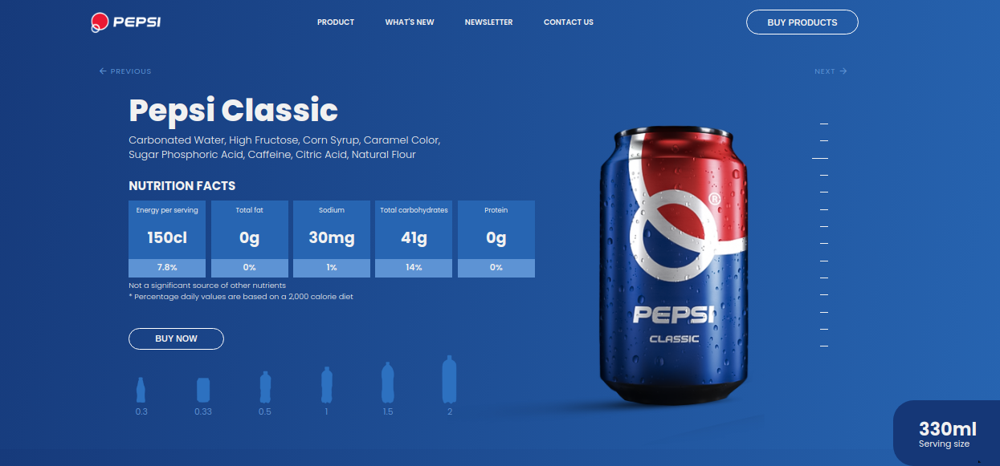
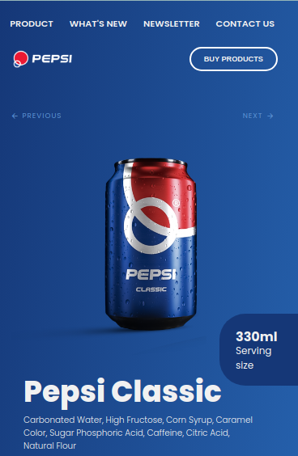
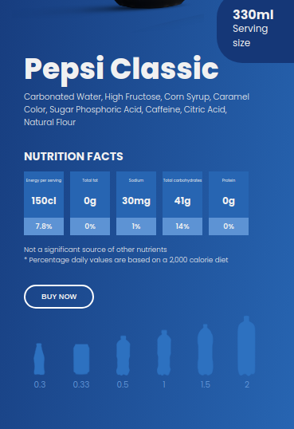

# Responsive Pepsi Website using HTML, CSS and JS

## Table of Contents

- [Overview](#overview)
- [Screenshot](#screenshot)
- [My process](#my-process)
  - [Tools used](#tools-used)
  - [Challenges faced](#challenges-faced)
  - [Lessons learned](#lessons-learned)
- [Credit](#credit)
- [Author](#author)

## Overview

In this project, I created a single-page Pepsi website using plain HTML, CSS and JS. It's always fun building websites like these using core stack (html, css and js) as they allow to strengthen the fundamentals and help them become more intuitive.

## Screenshot

Down below I've added the screenshot of my project final results.

Desktop View:

Mobile View:

## My process

### Tools used

Following are the tools/languages that were used to build this project.

- Semantic HTML5
- CSS3
- Custom css variables
- Media queries for responsiveness
- Flexbox for layout
- JS
- DOM manipulation

### Challenges faced

- The major challenge for me was to make this project responsive:

  - I had to add many media queries to cater for changing screen sizes. As for screen sizes greater than 768px, I wanted the layout to be similar to be standard (as show in the desktop screenshot).
  - Further, more media queries were used to make this project responsive for smaller devices. - Took a lot of time and effort to size and position elements precisely for dynamic screen sizes.

### Lessons learned

- Building this project was fun as throughout the entire process I felt that I was creating something real-world and meaningful. There were two major lessons that this project taught me

  - Dynamically updating items that are stored in a list.
  - How navigation sliders (next and previous buttons) can be made interactive using JS.
  - Power of media queries to make websites responsive for all screen sizes.

It took decent amount of CSS to style. The design was modern and it was fun practicing CSS that was required to build this project.

## Credit

I got to know about this project from a YouTube video. Though I did not follow the video and code along. I just viewed the website and its functionalities. I just viewed the bit to learn how to work with lists in DOM and how I can update values dynamically depending upon user interactions.

Check out this amazing [tutorial](https://www.youtube.com/watch?v=Pe-QrikwqV0&list=PLtUrcfzQl6gvhgrI4FJgiBfL8zHumvWLC&index=3&t=146s) and try building this project.

Happy coding!

## Author

- My GitHub - [Devang Vishnu](https://github.com/thedevangvishnu)
